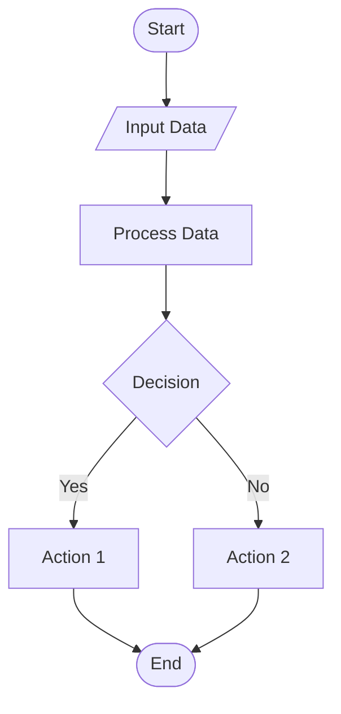

# A level computing notes

- [A level computing notes](#a-level-computing-notes)
- [Algorithms and Data Structure](#algorithms-and-data-structure)
  - [Algorithmic Representation (key concepts)](#algorithmic-representation-key-concepts)
    - [Algorithm](#algorithm)
    - [Program Flow](#program-flow)
    - [Control Structures](#control-structures)
    - [Modular Design](#modular-design)
      - [Key Principles of Modular Design:](#key-principles-of-modular-design)
      - [Benefits of Modular Design:](#benefits-of-modular-design)
      - [Examples of Modular Design:](#examples-of-modular-design)
  - [Types of Algorithmic Representation](#types-of-algorithmic-representation)
    - [Pseudo-code](#pseudo-code)
    - [Flowchart](#flowchart)
    - [Decision Table](#decision-table)
      - [Benefits:](#benefits)
  - [Fundamental Algorithms](#fundamental-algorithms)
    - [Insertion Sort](#insertion-sort)
    - [Bubble Sort](#bubble-sort)
    - [Quicksort](#quicksort)
    - [Merge Sort](#merge-sort)
    - [Linear Search](#linear-search)
    - [Binary Search](#binary-search)
    - [Hash Table Search](#hash-table-search)
  - [Data Structures](#data-structures)
    - [Static Allocation of memory](#static-allocation-of-memory)
- [Programming](#programming)
  - [Coding Standards](#coding-standards)
    - [2.2 Programming Elements and Constructs](#22-programming-elements-and-constructs)
    - [2.3 Implementing Algorithms and Data Structures](#23-implementing-algorithms-and-data-structures)
  - [Data Validation and Program Testing](#data-validation-and-program-testing)
    - [Data Validation:](#data-validation)
    - [Data Verification:](#data-verification)
    - [Data Validation Techniques](#data-validation-techniques)
    - [Syntax, Logic, and Runtime Errors](#syntax-logic-and-runtime-errors)
      - [Syntax Errors:](#syntax-errors)
      - [Logic Errors:](#logic-errors)
      - [Runtime Errors:](#runtime-errors)
      - [Summary:](#summary)
    - [Data for Testing and Debugging Programs](#data-for-testing-and-debugging-programs)
      - [Normal Data:](#normal-data)
      - [Abnormal Data:](#abnormal-data)
      - [Extreme Data:](#extreme-data)
      - [Summary:](#summary-1)
  - [Fundamentals of Object-Oriented Programming.](#fundamentals-of-object-oriented-programming)
    - [Classes and Objects](#classes-and-objects)
      - [Classes:](#classes)
      - [Objects:](#objects)
    - [Encapsulation](#encapsulation)
      - [Key Points:](#key-points)
    - [Inheritance](#inheritance)
    - [Key Points:](#key-points-1)
    - [Explanation:](#explanation)
    - [Summary:](#summary-2)
  - [Data and Information](#data-and-information)
    - [3.1 Data Representation](#31-data-representation)
    - [3.2 Character Encoding](#32-character-encoding)
    - [3.3 Databases and Data Management](#33-databases-and-data-management)
    - [3.4 Social, Ethical, Legal and Economic Issues.](#34-social-ethical-legal-and-economic-issues)
  - [Computer Networks](#computer-networks)
    - [4.1 Fundamentals of Computer Networks](#41-fundamentals-of-computer-networks)
    - [4.2 Web Applications](#42-web-applications)
    - [4.3 Network Security](#43-network-security)

# Algorithms and Data Structure

## Algorithmic Representation (key concepts)

### Algorithm
Algorithm is a finite set of well-defined instructions or a step-by-step procedure for solving a problem or performing a task.

### Program Flow
Program flow refers to the order in which individual statements, instructions, or function calls are executed or evaluated in a programming environment. It dictates how the control moves through the code, determining the sequence of operations and the logic that governs the execution of the program.

### Control Structures
Control structures are fundamental constructs in programming that dictate the flow of control in a program. They enable the execution of specific blocks of code based on certain conditions or the repetition of code blocks. The main types of control structures are:

1. **Sequential Control**: The default mode where statements are executed one after another in the order they appear.

2. **Conditional Control**: These structures allow the execution of code blocks based on specific conditions.
   - **If-Else Statements**: Execute a block of code if a condition is true; otherwise, execute another block.
   - **Switch Statements**: Select one of many code blocks to execute based on the value of a variable.

3. **Loop Control**: These structures repeat a block of code multiple times until a condition is met.
   - **For Loops**: Repeat a block of code a specific number of times.
   - **While Loops**: Repeat a block of code as long as a condition is true.
   - **Do-While Loops**: Similar to while loops, but the block of code is executed at least once before the condition is tested.


### Modular Design
Modular design is a design approach that divides a system into smaller, self-contained units or modules, each of which can be developed, tested, and maintained independently. This approach is widely used in software engineering, architecture, and product design to improve manageability, flexibility, and scalability.

#### Key Principles of Modular Design:
1. **Separation of Concerns**: Each module addresses a specific aspect of the system, reducing complexity and making the system easier to understand.
2. **Encapsulation**: Modules hide their internal implementation details and expose only necessary interfaces, promoting information hiding and reducing dependencies.
3. **Reusability**: Modules can be reused across different parts of the system or in different projects, reducing redundancy and development time.
4. **Interchangeability**: Modules can be replaced or updated independently without affecting the rest of the system, enhancing maintainability.
5. **Scalability**: The system can be easily scaled by adding or modifying modules without significant changes to the overall architecture.

#### Benefits of Modular Design:
1. **Improved Maintainability**: Easier to update and fix individual modules without impacting the entire system.
2. **Enhanced Collaboration**: Teams can work on different modules simultaneously, improving productivity.
3. **Better Testing**: Modules can be tested independently, leading to more reliable and robust systems.
4. **Flexibility**: Easier to adapt to changing requirements by modifying or adding modules.

#### Examples of Modular Design:
- **Object-Oriented Programming (OOP)**: Classes and objects encapsulate data and behavior, promoting modularity.
- **Microservices Architecture**: A system is divided into small, independent services that communicate over a network.
- **Component-Based Development**: Software is built using reusable components, each responsible for a specific functionality.


## Types of Algorithmic Representation 

### Pseudo-code


### Flowchart


### Decision Table
A decision table is a tabular method for representing and analyzing decision logic, which is often used in software engineering and business rule management. It provides a systematic way to capture and organize complex decision-making processes by mapping conditions to corresponding actions.


| Conditions          | Rule 1 | Rule 2 | Rule 3 | Rule 4 |
|---------------------|--------|--------|--------|--------|
| Condition 1         | Yes    | Yes    | No     | No     |
| Condition 2         | Yes    | No     | Yes    | No     |
| Condition 3         | Yes    | Yes    | Yes    | No     |
| **Actions**         |        |        |        |        |
| Actions 1           | Yes    | No     | No     | No     |
| Actions 2           | No     | Yes    | Yes    | No     |
| Actions 3           | No     | No     | No     | Yes    |

#### Benefits:
- **Clarity**: Provides a clear and concise way to represent complex decision logic.
- **Consistency**: Ensures that all possible conditions and actions are considered.
- **Documentation**: Serves as a useful documentation tool for decision-making processes.
- **Validation**: Helps in validating and verifying the decision logic.

Decision tables are particularly useful in scenarios where multiple conditions need to be evaluated to determine the appropriate action, such as business rules, software requirements, and process management.


## Fundamental Algorithms

### Insertion Sort
Insertion Sort builds the final sorted array one item at a time. It is much less efficient on large lists than more advanced algorithms such as quicksort, heapsort, or merge sort.

**Process**:
   - Start with the second element (index 1) of the array, considering the first element (index 0) as a sorted subarray.
   - Compare the current element (key) with the elements in the sorted subarray.
   - Shift all elements in the sorted subarray that are greater than the key to one position to the right.
   - Insert the key into its correct position in the sorted subarray.
   - Repeat the process for all elements in the array.

**Example**:
```python
def insertion_sort(arr):
    # Traverse through 1 to len(arr)
    for i in range(1, len(arr)):
        key = arr[i]
        # Move elements of arr[0..i-1], that are greater than key,
        # to one position ahead of their current position
        j = i - 1
        while j >= 0 and key < arr[j]:
            arr[j + 1] = arr[j]
            j -= 1
        arr[j + 1] = key
    return arr

# Example usage
arr = [12, 11, 13, 5, 6]
sorted_arr = insertion_sort(arr)
print("Sorted array is:", sorted_arr)
```
   - Given array: `[12, 11, 13, 5, 6]`
   - Start with the second element (11):
     - Compare 11 with 12, since 11 < 12, swap them. Array becomes `[11, 12, 13, 5, 6]`.
   - Move to the third element (13):
     - 13 is already in the correct position. Array remains `[11, 12, 13, 5, 6]`.
   - Move to the fourth element (5):
     - Compare 5 with 13, 12, and 11, and shift them to the right. Insert 5 at the beginning. Array becomes `[5, 11, 12, 13, 6]`.
   - Move to the fifth element (6):
     - Compare 6 with 13, 12, and 11, and shift them to the right. Insert 6 in the correct position. Array becomes `[5, 6, 11, 12, 13]`.

**Complexity**:
   - **Time Complexity**: O(n^2) in the worst and average case, where n is the number of elements.
   - **Space Complexity**: O(1) as it is an in-place sorting algorithm.

Insertion Sort is easy to implement and efficient for small datasets or nearly sorted arrays. However, it is not suitable for large datasets due to its quadratic time complexity.


### Bubble Sort
Bubble Sort repeatedly steps through the list, compares adjacent elements, and swaps them if they are in the wrong order. The process is repeated until the list is sorted.

**Process**:
   - Start at the beginning of the list.
   - Compare the first two elements. If the first element is greater than the second, swap them.
   - Move to the next pair of elements and repeat the comparison and swap if necessary.
   - Continue this process for each pair of adjacent elements to the end of the list.
   - After each pass through the list, the largest element will have "bubbled up" to its correct position.
   - Repeat the process for the remaining elements, excluding the last sorted elements, until no swaps are needed.

**Example**:
```python
def bubble_sort(arr):
    n = len(arr)
    # Traverse through all array elements
    for i in range(n):
        # Last i elements are already in place
        for j in range(0, n-i-1):
            # Traverse the array from 0 to n-i-1
            # Swap if the element found is greater than the next element
            if arr[j] > arr[j+1]:
                arr[j], arr[j+1] = arr[j+1], arr[j]
    return arr

# Example usage
arr = [5, 1, 4, 2, 8]
sorted_arr = bubble_sort(arr)
print("Sorted array is:", sorted_arr)
```
   - Given array: `[5, 1, 4, 2, 8]`
   - First pass:
     - Compare 5 and 1, swap. Array becomes `[1, 5, 4, 2, 8]`.
     - Compare 5 and 4, swap. Array becomes `[1, 4, 5, 2, 8]`.
     - Compare 5 and 2, swap. Array becomes `[1, 4, 2, 5, 8]`.
     - Compare 5 and 8, no swap. Array remains `[1, 4, 2, 5, 8]`.
   - Second pass:
     - Compare 1 and 4, no swap. Array remains `[1, 4, 2, 5, 8]`.
     - Compare 4 and 2, swap. Array becomes `[1, 2, 4, 5, 8]`.
     - Compare 4 and 5, no swap. Array remains `[1, 2, 4, 5, 8]`.
     - Compare 5 and 8, no swap. Array remains `[1, 2, 4, 5, 8]`.
   - The array is now sorted.

**Complexity**:
   - **Time Complexity**: O(n^2) in the worst and average case, where n is the number of elements.
   - **Space Complexity**: O(1) as it is an in-place sorting algorithm.

Bubble Sort is easy to understand and implement but is inefficient for large datasets due to its quadratic time complexity. It is mainly used for educational purposes and small datasets.

### Quicksort
Quicksort uses a divide-and-conquer strategy to sort elements. It works by selecting a 'pivot' element from the array and partitioning the other elements into two sub-arrays, according to whether they are less than or greater than the pivot.

**Process**:
   - Choose a pivot element from the array.
   - Partition the array into two sub-arrays: elements less than the pivot and elements greater than the pivot.
   - Recursively apply the same process to the sub-arrays.
   - Combine the sub-arrays and the pivot to get the sorted array.

**Example**:
```python
def quicksort(arr, low, high):
    if low < high:
        # pi is partitioning index, arr[pi] is now at right place
        pi = partition(arr, low, high)

        # Separately sort elements before partition and after partition
        quicksort(arr, low, pi-1)
        quicksort(arr, pi+1, high)

def partition(arr, low, high):
    # Pivot (Element to be placed at right position)
    pivot = arr[high]

    i = low - 1  # Index of smaller element

    for j in range(low, high):
        # If current element is smaller than or equal to pivot
        if arr[j] <= pivot:
            i = i + 1
            arr[i], arr[j] = arr[j], arr[i]  # Swap

    arr[i + 1], arr[high] = arr[high], arr[i + 1]  # Swap pivot element with element at i+1
    return i + 1

# Example usage
arr = [10, 7, 8, 9, 1, 5]
n = len(arr)
quicksort(arr, 0, n-1)
print("Sorted array is:", arr)
```
   - Given array: `[10, 7, 8, 9, 1, 5]`
   - Choose pivot: 5
   - Partitioning:
     - Elements less than 5: `[1]`
     - Elements greater than 5: `[10, 7, 8, 9]`
   - Recursively apply quicksort to the sub-arrays:
     - `[1]` is already sorted.
     - Apply quicksort to `[10, 7, 8, 9]` with pivot 9:
       - Elements less than 9: `[7, 8]`
       - Elements greater than 9: `[10]`
     - Recursively apply quicksort to `[7, 8]` with pivot 8:
       - Elements less than 8: `[7]`
       - Elements greater than 8: `[]`
     - Combine to get `[7, 8]`
     - Combine to get `[7, 8, 9, 10]`
   - Combine all parts to get `[1, 5, 7, 8, 9, 10]`

**Complexity**:
   - **Time Complexity**:
     - Best case: O(n log n)
     - Average case: O(n log n)
     - Worst case: O(n^2) (when the smallest or largest element is always chosen as the pivot)
   - **Space Complexity**: O(log n) due to the recursion stack.

Quicksort is efficient and performs well on average. It is widely used in practice due to its good performance and simplicity. However, its worst-case performance can be poor, but this can be mitigated by using good pivot selection strategies.

### Merge Sort
Merge Sort divides the array into halves, sorts each half, and then merges the sorted halves to produce the sorted array.

**Process**:
   - Divide the array into two halves.
   - Recursively sort each half.
   - Merge the two sorted halves to produce the sorted array.

**Example**:
```python
def merge_sort(arr):
    if len(arr) > 1:
        # Finding the mid of the array
        mid = len(arr) // 2

        # Dividing the array elements into 2 halves
        left_half = arr[:mid]
        right_half = arr[mid:]

        # Recursively sorting the first half
        merge_sort(left_half)

        # Recursively sorting the second half
        merge_sort(right_half)

        i = j = k = 0

        # Copy data to temp arrays L[] and R[]
        while i < len(left_half) and j < len(right_half):
            if left_half[i] < right_half[j]:
                arr[k] = left_half[i]
                i += 1
            else:
                arr[k] = right_half[j]
                j += 1
            k += 1

        # Checking if any element was left
        while i < len(left_half):
            arr[k] = left_half[i]
            i += 1
            k += 1

        while j < len(right_half):
            arr[k] = right_half[j]
            j += 1
            k += 1

# Example usage
arr = [38, 27, 43, 3, 9, 82, 10]
merge_sort(arr)
print("Sorted array is:", arr)
```
   - Given array: `[38, 27, 43, 3, 9, 82, 10]`
   - Divide into halves: `[38, 27, 43]` and `[3, 9, 82, 10]`
   - Recursively sort each half:
     - `[38, 27, 43]` becomes `[27, 38, 43]`
     - `[3, 9, 82, 10]` becomes `[3, 9, 10, 82]`
   - Merge the sorted halves:
     - Merge `[27, 38, 43]` and `[3, 9, 10, 82]` to get `[3, 9, 10, 27, 38, 43, 82]`

**Complexity**:
   - **Time Complexity**: O(n log n) in all cases (worst, average, and best) where n is the number of elements.
   - **Space Complexity**: O(n) due to the additional space required for the temporary arrays used in merging.

Merge Sort is efficient and guarantees O(n log n) time complexity. It is stable and works well for large datasets. However, it requires additional space for merging, which can be a drawback for large arrays.

### Linear Search
Linear Search sequentially checks each element of the list until the desired element is found or the list ends.

**Process**:
   - Start from the first element of the list.
   - Compare the current element with the target value.
   - If the current element matches the target value, return the index of the element.
   - If the current element does not match the target value, move to the next element.
   - Repeat the process until the target value is found or the end of the list is reached.


**Example**:
```python
def linear_search(arr, target):
    # Traverse through all elements in the array
    for index, element in enumerate(arr):
        # Check if the current element is the target
        if element == target:
            return index  # Return the index of the target element
    return -1  # Return -1 if the target is not found

# Example usage
arr = [10, 20, 30, 40, 50]
target = 30
result = linear_search(arr, target)

if result != -1:
    print(f"Element found at index: {result}")
else:
    print("Element not found in the array")
```
   - Given list: `[10, 20, 30, 40, 50]`
   - Target value: `30`
   - Start from the first element:
     - Compare 10 with 30: not a match.
     - Compare 20 with 30: not a match.
     - Compare 30 with 30: match found at index 2.
   - Return index 2.

**Complexity**:
   - **Time Complexity**: O(n) where n is the number of elements in the list.
   - **Space Complexity**: O(1) as it requires a constant amount of additional space.

Linear Search is simple and easy to implement. It is suitable for small or unsorted lists. However, it is inefficient for large lists as it has a linear time complexity. For sorted lists or large datasets, more efficient algorithms like binary search are preferred.

### Binary Search
Binary Search works by repeatedly dividing the search interval in half. If the value of the search key is less than the item in the middle of the interval, narrow the interval to the lower half. Otherwise, narrow it to the upper half. Repeat until the value is found or the interval is empty.

**Process**:
   - Start with the entire list.
   - Find the middle element of the list.
   - Compare the middle element with the target value.
   - If the middle element is equal to the target value, return the index of the middle element.
   - If the target value is less than the middle element, repeat the search on the left half of the list.
   - If the target value is greater than the middle element, repeat the search on the right half of the list.
   - Continue this process until the target value is found or the search interval is empty.

**Example**:
```python
def binary_search(arr, target):
    low = 0
    high = len(arr) - 1

    while low <= high:
        mid = (low + high) // 2

        # Check if target is present at mid
        if arr[mid] == target:
            return mid
        # If target is greater, ignore the left half
        elif arr[mid] < target:
            low = mid + 1
        # If target is smaller, ignore the right half
        else:
            high = mid - 1

    # Target is not present in the array
    return -1

# Example usage
arr = [10, 20, 30, 40, 50]
target = 30
result = binary_search(arr, target)

if result != -1:
    print(f"Element found at index: {result}")
else:
    print("Element not found in the array")
```
   - Given sorted list: `[10, 20, 30, 40, 50]`
   - Target value: [`30`]
   - Initial `low = 0`, `high = 4`
   - Calculate `mid = (0 + 4) // 2 = 2`
   - Compare `list[2]` (which is 30) with 30: match found at index 2.
   - Return index 2.

**Complexity**:
   - **Time Complexity**: O(log n) where n is the number of elements in the list.
   - **Space Complexity**: O(1) for the iterative version and O(log n) for the recursive version due to the call stack.

Binary Search is much more efficient than Linear Search for large, sorted lists due to its logarithmic time complexity. It is widely used in practice for searching in sorted arrays or lists. However, it requires the list to be sorted beforehand.

### Hash Table Search
A hash table uses a hash function to compute an index (or hash code) into an array of buckets or slots, from which the desired value can be found.

**Process**:
   - A hash function is applied to the search key to determine the index in the hash table where the corresponding value is stored.
   - The hash function maps the search key to a specific bucket.
   - If the bucket contains multiple entries (due to collisions), search through the bucket to find the exact match for the search key.
   - The value is then retrieved from the bucket.

**Example**:
   - Given a hash table with keys and values: `{ "apple": 1, "banana": 2, "cherry": 3 }`
   - Search key: `"banana"`
   - Compute the hash code for `"banana"` using the hash function.
   - Suppose the hash code maps to index 2.
   - Access the bucket at index 2.
   - Find the entry with the key `"banana"` and retrieve the value `2`.

**Complexity**:
   - **Time Complexity**: O(1) on average for both search and insert operations, assuming a good hash function and low load factor.
   - **Space Complexity**: O(n) where n is the number of elements in the hash table.

Hash Table Search is highly efficient for search, insert, and delete operations due to its average-case constant time complexity. It is widely used in various applications, including databases and caching mechanisms. However, the efficiency depends on the quality of the hash function and the handling of collisions.


## Data Structures 

### Static Allocation of memory
1.3.2 Understand the concept of dynamic allocation of memory.
1.3.3 Create, insert, and delete operations for stack and queue (linear and circular).
1.3.4 Understand the concept of free space list (which could be another linked list or an array).
1.3.5 Create, update (edit, insert, delete) and search operations for a linear linked list.
Exclude: doubly-linked list and circular linked list
1.3.6 Create, update (edit, insert, delete) and search operations for a binary tree (including binary search
tree).
Exclude: edit and deletion of nodes from binary search tree
1.3.7 Understand pre-order, in-order and post-order tree traversals; and application of in-order tree
traversal for a binary tree. 


# Programming

## Coding Standards
- Proper indentation and white space improve the readability of the code.
- Follow the language-specific guidelines for indentation (e.g. 4 spaces for Python).
- Use descriptive and meaningful names for variables, functions, classes, and other identifiers.
- Follow the naming conventions of the programming language (e.g. camelCase and snake_case).
- Include comments to explain the purpose and functionality of the code.
- Maintain version control comments to track changes for version bookkeeping/control


### 2.2 Programming Elements and Constructs
2.2.1 Understand the different types: integer, real, char, string and Boolean and initialise arrays (1-
dimensional and 2-dimensional).
2.2.2 Use common library functions for input/output, strings and mathematical operations.
2.2.3 Apply the fundamental programming constructs to control the flow of program execution:
– Sequence
– Selection
– Iteration
2.2.4 Use functions and procedures to modularise problem into chunks of code.
2.2.5 Understand the concept of recursion.
2.2.6 Trace the steps and list the results of recursive and non-recursive programs.
2.2.7 Understand the use of stacks in recursive programming. 

### 2.3 Implementing Algorithms and Data Structures

– Hash table search
2.3.3 Write programs to implement operations for stacks, queues (linear and circular), linear linked lists
and binary search trees.
Exclude: doubly-linked list and circular linked list
2.3.4 Store data in and retrieve data from serial and sequential text files. 


## Data Validation and Program Testing

### Data Validation:
- **Definition**: Data validation is the process of ensuring that the data entered into a system meets predefined criteria and is both correct and useful.
- **Purpose**: To ensure the accuracy and quality of the data before it is processed. Ensuring the accuracy, completeness, and reasonableness of the data.
- **When**: Typically performed at the point of data entry.
- **Examples**:
  - Ensuring a user's email address is in the correct format.
  - Checking that a date of birth is within a reasonable range.
  - Verifying that a required field is not left empty.

### Data Verification:
- **Definition**: Data verification is the process of ensuring that data is consistent, accurate, and reliable by comparing it against a trusted source or standard.
- **Purpose**: To confirm that the data has not been altered or corrupted and matches the original source. Ensuring the integrity and consistency of the data.
- **When**: Typically performed after data entry, during data processing, or before data is used for decision-making.
- **Examples**:
  - Comparing data entered into a system with the original paper records.
  - Checking that data transferred from one system to another remains unchanged.
  - Verifying that a backup copy of data matches the original data.

### Data Validation Techniques
Data validation is crucial to ensure the accuracy, completeness, and reliability of data. Here are some common data validation techniques:

1. **Range Check**:
   - Ensures that the data entered falls within a specified range.
   - Example: Validating that a user's age is between 0 and 120.

2. **Format Check**:
   - Ensures that the data entered follows a specific format or pattern.
   - Example: Validating that an email address follows the pattern `username@domain.com`.

3. **Length Check**:
   - Ensures that the data entered meets a specified length requirement.
   - Example: Validating that a password is at least 8 characters long.
  
3. **Type Check**:
   - Ensures that the data entered is of the correct data type (e.g., integer, string, date).
   - Example: Ensuring a phone number field contains only numeric values.

4. **Presence Check**:
   - Ensures that a required field is not left empty.
   - Example: Validating that a mandatory field like "First Name" is filled out.

5. **Check Digit**:
    - It is an extra digit added to a number that is calculated from the other digits in the number. The purpose of the check digit is to detect errors in data entry or transmission.
    - Example: Luhn Algorithm(used for credit card numbers)


### Syntax, Logic, and Runtime Errors

#### Syntax Errors:
- **Definition**: Syntax errors occur when the code violates the rules of the programming language. These errors are detected by the compiler or interpreter during the parsing phase.
- **Characteristics**:
  - Prevent the code from being compiled or interpreted.
  - Typically caused by typos, missing punctuation, incorrect indentation, or incorrect use of language constructs.
- **Examples**:
  - Missing a colon in Python:
    ```python
    if x > 10  # Syntax error: missing colon
        print("x is greater than 10")
    ```
  - Unmatched parentheses:
    ```python
    print("Hello, world!"  # Syntax error: unmatched parenthesis
    ```

#### Logic Errors:
- **Definition**: Logic errors occur when the code runs without crashing but produces incorrect results. These errors are due to flaws in the program's logic.
- **Characteristics**:
  - The code compiles and runs but does not behave as intended.
  - Often harder to detect and debug because the program does not crash.
- **Examples**:
  - Incorrect calculation:
    ```python
    def calculate_area(radius):
        return 2 * 3.14 * radius  # Logic error: should be 3.14 * radius * radius
    ```
  - Incorrect condition:
    ```python
    if x < 10:
        print("x is greater than or equal to 10")  # Logic error: incorrect condition
    ```

#### Runtime Errors:
- **Definition**: Runtime errors occur while the program is running. These errors are typically caused by illegal operations or unexpected conditions.
- **Characteristics**:
  - The code compiles successfully but crashes or behaves unexpectedly during execution.
  - Often caused by invalid input, resource limitations, or unhandled exceptions.
- **Examples**:
  - Division by zero:
    ```python
    x = 10 / 0  # Runtime error: division by zero
    ```
  - Accessing an invalid index in a list:
    ```python
    my_list = [1, 2, 3]
    print(my_list[5])  # Runtime error: index out of range
    ```

#### Summary:
- **Syntax Errors**: Detected at compile time, caused by violations of language rules.
- **Logic Errors**: Detected during execution, caused by flaws in the program's logic, leading to incorrect results.
- **Runtime Errors**: Detected during execution, caused by illegal operations or unexpected conditions, leading to program crashes or unexpected behavior.


### Data for Testing and Debugging Programs

#### Normal Data:
- **Definition**: Normal data refers to the typical, expected input values that a program is designed to handle. These values fall within the usual operating range and meet all the input criteria.
- **Purpose**: To ensure that the program functions correctly under standard conditions.
- **Examples**:
  - For a function that calculates the square of a number, normal data might be integers like 2, 5, and 10.
  - For a form that accepts user names, normal data might be strings like "Alice", "Bob", and "Charlie".

#### Abnormal Data:
- **Definition**: Abnormal data refers to input values that are outside the expected range or format. These values are invalid and should be handled gracefully by the program, typically by generating error messages or exceptions.
- **Purpose**: To ensure that the program can handle invalid inputs without crashing and provides appropriate error handling.
- **Examples**:
  - For a function that calculates the square of a number, abnormal data might be strings like "abc" or special characters like "@#$".
  - For a form that accepts user names, abnormal data might be empty strings or strings with special characters like "Alice@123".

#### Extreme Data:
- **Definition**: Extreme data refers to input values that are at the boundary of the acceptable range. These values test the limits of the program's handling of input data.
- **Purpose**: To ensure that the program can handle edge cases and boundary conditions correctly.
- **Examples**:
  - For a function that calculates the square of a number, extreme data might be very large numbers like 1,000,000 or very small numbers like -1,000,000.
  - For a form that accepts user names, extreme data might be the maximum allowed length of a user name, such as a string with 255 characters.

#### Summary:
- **Normal Data**: Typical, expected input values that the program is designed to handle.
- **Abnormal Data**: Invalid input values that fall outside the expected range or format, used to test error handling.
- **Extreme Data**: Boundary input values that test the limits of the program's handling of input data, used to ensure robustness against edge cases.


## Fundamentals of Object-Oriented Programming. 
**Object-Oriented Programming(OOP)** is a programming paradigm that uses "objects" to design applications and computer programs. It utilizes several key concepts to create reusable and modular code.

### Classes and Objects

#### Classes:
- **Definition**: A class is a blueprint or template for creating objects. It defines a set of attributes and methods that the created objects will have.
- **Attributes**: These are variables that hold data specific to the class.
- **Methods**: These are functions defined within a class that describe the behaviors of the objects created from the class.

**Example in Python**:
```python
class Car:
    # Class attribute
    wheels = 4

    # Constructor method to initialize object attributes
    def __init__(self, make, model, year):
        self.make = make  # Instance attribute
        self.model = model  # Instance attribute
        self.year = year  # Instance attribute

    # Method to describe the car
    def description(self):
        return f"{self.year} {self.make} {self.model}"
```

#### Objects:
- **Definition**: An object is an instance of a class. It is created using the class blueprint and can have its own unique values for the attributes defined in the class.
- **Instantiation**: The process of creating an object from a class is called instantiation.

**Example in Python**:
```python
# Creating objects from the Car class
car1 = Car("Toyota", "Corolla", 2020)
car2 = Car("Honda", "Civic", 2019)

# Accessing object attributes and methods
print(car1.description())  # Output: 2020 Toyota Corolla
print(car2.description())  # Output: 2019 Honda Civic
```


### Encapsulation
**Encapsulation** is one of the fundamental concepts in object-oriented programming (OOP). It refers to the bundling of data (attributes) and methods (functions) that operate on the data into a single unit, known as a class. Encapsulation also involves restricting direct access to some of the object's components, which can prevent the accidental modification of data.

#### Key Points:
1. **Data Hiding**:
   - Encapsulation allows the internal representation of an object to be hidden from the outside. Only the necessary information is exposed through public methods.
   - This is achieved by making attributes private (using a naming convention like a leading underscore `_` in Python) and providing public getter and setter methods to access and modify the attributes.

2. **Implementation Independence**:
   - The internal implementation of a class can be changed without affecting the code that uses the class. This promotes modularity and maintainability.
   - Users of the class interact with it through a well-defined interface (public methods), without needing to know the details of the implementation.

3. **Improved Security**:
   - By restricting access to the internal state of an object, encapsulation helps protect the integrity of the data. It ensures that the data can only be modified in controlled ways.

**Example in Python:**
```python
class Car:
    def __init__(self, make, model, year):
        self._make = make  # Private attribute
        self._model = model  # Private attribute
        self._year = year  # Private attribute

    # Getter method for make
    def get_make(self):
        return self._make

    # Setter method for make
    def set_make(self, make):
        self._make = make

    # Getter method for model
    def get_model(self):
        return self._model

    # Setter method for model
    def set_model(self, model):
        self._model = model

    # Getter method for year
    def get_year(self):
        return self._year

    # Setter method for year
    def set_year(self, year):
        self._year = year

    # Method to describe the car
    def description(self):
        return f"{self._year} {self._make} {self._model}"

# Example usage
car = Car("Toyota", "Corolla", 2020)
print(car.description())  # Output: 2020 Toyota Corolla

# Accessing and modifying attributes using getter and setter methods
car.set_year(2021)
print(car.get_year())  # Output: 2021
```

### Inheritance

**Inheritance** is a fundamental concept in object-oriented programming (OOP) that allows a class (called a subclass or derived class) to inherit attributes and methods from another class (called a superclass or base class). This promotes code reuse and establishes a natural hierarchy between classes.

### Key Points:
1. **Code Reuse**:
   - Inheritance allows subclasses to reuse code from the superclass, reducing redundancy and improving maintainability.
   - Common attributes and methods are defined in the superclass and inherited by subclasses.

2. **Hierarchy**:
   - Inheritance creates a hierarchical relationship between classes.
   - The superclass represents a general concept, while subclasses represent more specific concepts.

3. **Overriding**:
   - Subclasses can override methods from the superclass to provide specific implementations.
   - This allows subclasses to modify or extend the behavior of inherited methods.

4. **Extensibility**:
   - Inheritance makes it easy to extend existing code by creating new subclasses.
   - New functionality can be added without modifying existing code.

**Example in Python:**
```python
# Superclass
class Vehicle:
    def __init__(self, make, model, year):
        self.make = make
        self.model = model
        self.year = year

    def description(self):
        return f"{self.year} {self.make} {self.model}"

# Subclass
class Car(Vehicle):
    def __init__(self, make, model, year, num_doors):
        super().__init__(make, model, year)  # Call the constructor of the superclass
        self.num_doors = num_doors

    def description(self):
        return f"{self.year} {self.make} {self.model} with {self.num_doors} doors"

# Example usage
car = Car("Toyota", "Corolla", 2020, 4)
print(car.description())  # Output: 2020 Toyota Corolla with 4 doors
```

### Explanation:
1. **Superclass (Vehicle)**:
   - The `Vehicle` class defines common attributes (`make`, `model`, `year`) and a method `description` that can be used by all vehicles.

2. **Subclass (Car)**:
   - The `Car` class inherits from the `Vehicle` class using the syntax `class Car(Vehicle)`.
   - The `Car` class adds an additional attribute `num_doors` and overrides the `description` method to provide a more specific implementation.

3. **Constructor Call**:
   - The `super().__init__(make, model, year)` call in the `Car` class constructor invokes the constructor of the `Vehicle` class to initialize the inherited attributes.

4. **Example Usage**:
   - An instance of the `Car` method is called to demonstrate inheritance and method overriding.

### Summary:
- **Inheritance**: Allows a subclass to inherit attributes and methods from a superclass, promoting code reuse and establishing a class hierarchy.
- **Code Reuse**: Reduces redundancy by reusing common code in the superclass.
- **Hierarchy**: Creates a natural relationship between general and specific classes.
- **Overriding**: Subclasses can override inherited methods to provide specific implementations.
- **Extensibility**: Makes it easy to extend existing code by creating new subclasses.


2.5.3 Understand inheritance and how it promotes software reuse.
2.5.4 Understand polymorphism and how it enables code generalisation.
Exclude: method overloading and multiple inheritance
2.5.5 Draw class diagrams to illustrate the relationship between classes (including attributes and
methods). 

## Data and Information

### 3.1 Data Representation
3.1.1 Represent data in binary and hexadecimal forms.
3.1.2 Write programs to perform the conversion of positive integers between different number bases:
denary, binary and hexadecimal forms; and display results

### 3.2 Character Encoding
3.2.1 Give examples of where or how Unicode is used.
3.2.2 Use ASCII code in programs. 

### 3.3 Databases and Data Management
3.3.1 Determine the attributes of a database: table, record and field.
3.3.2 Explain the purpose of and use primary, secondary, composite and foreign keys in tables.
3.3.3 Explain with examples, the concept of data redundancy and data dependency.
3.3.4 Reduce data redundancy to third normal form (3NF).
3.3.5 Draw entity-relationship (ER) diagrams to show the relationship between tables.
3.3.6 Understand how NoSQL database management system addresses the shortcomings of relational
database management system (SQL).
3.3.7 Explain the applications of SQL and NoSQL.
3.3.8 Write SQL statements and use a programming language to work with SQL and NoSQL databases.
3.3.9 Understand the need for privacy and integrity of data.
3.3.10 Describe methods to protect data.
3.3.11 Explain the difference between backup and archive.
3.3.12 Describe the need for version control and naming convention.
3.3.13 Explain how data in Singapore is protected under the Personal Data Protection Act to govern the
collection, use and disclosure of personal data. 

### 3.4 Social, Ethical, Legal and Economic Issues.
3.4.1 Understand the code of ethics (conduct) of a Computing professional.
3.4.2 Describe the impact of computing on lifestyle and workplace for social and economic developments.
3.4.3 Discuss the social, ethical, legal and economic issues of computing and technology. 

## Computer Networks

### 4.1 Fundamentals of Computer Networks
4.1.1 Explain the concepts of LAN, WAN, intranet and the structure of the internet.
4.1.2 Understand the concepts of IP addressing and domain name server (DNS).
4.1.3 Explain the need for communication protocols in a network.
4.1.4 Explain how data is transmitted in a packet-switching network.
4.1.5 Explain client-server architecture.
4.1.6 Implement an iterative server with socket programming. Given the server code, students should be
able to implement the client code for a given scenario, and vice-versa, e.g. for a tic-tac-toe game. 

### 4.2 Web Applications
4.2.1 Describe the differences between web applications and native applications.
4.2.2 State and apply usability principles in the design of web applications.
4.2.3 Use HTML, CSS (for clients) and Python (for the server) to create a web application that is able to:
– accept user input (text and image file uploads)
– process the input on the local server
– store and retrieve data using an SQL database
– display the output (as formatted text/images/table).
4.2.4 Test a web application on a local server. 

### 4.3 Network Security 
4.3.1 Understand how malware (e.g. worms and viruses) and denial of service (DOS) attacks can
compromise computer systems.
4.3.2 Understand how firewall (filtering function), intrusion detection system (IDS) and intrusion prevention
system (IPS) can be used to restrict network access, and their limitations.
4.3.3 Understand how encryption, digital signature, and authentication can ensure security of network
applications. 